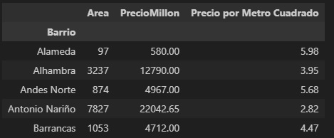
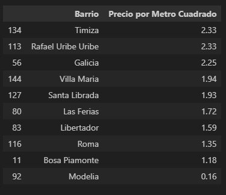
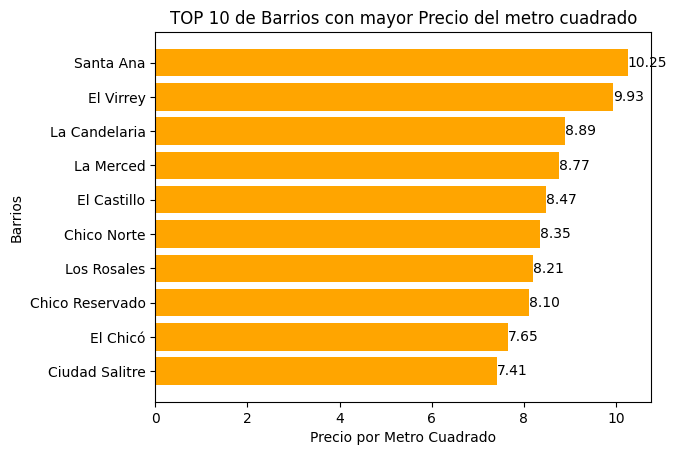
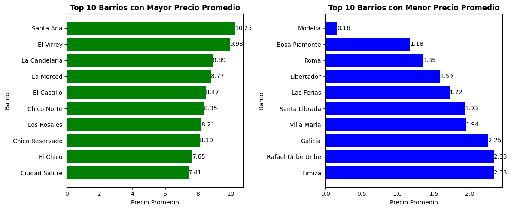
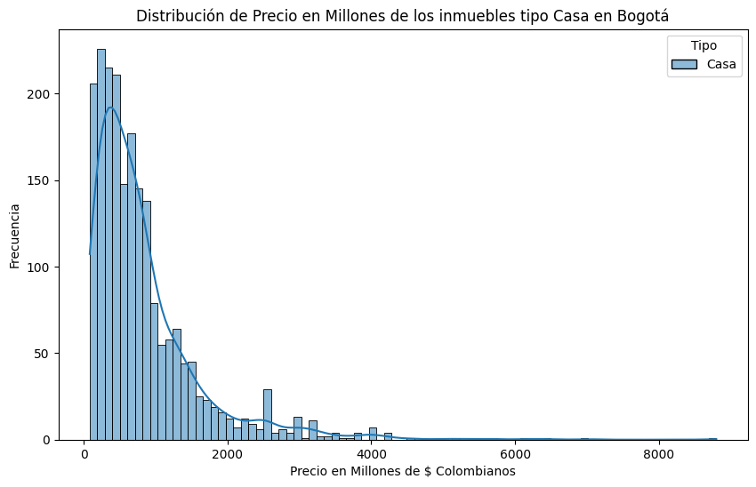
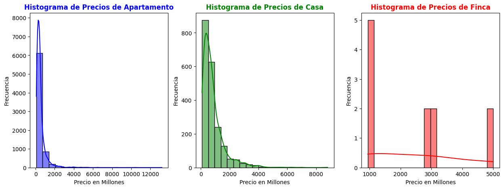
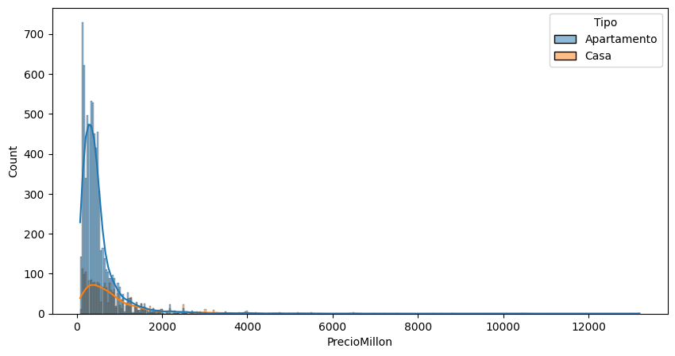
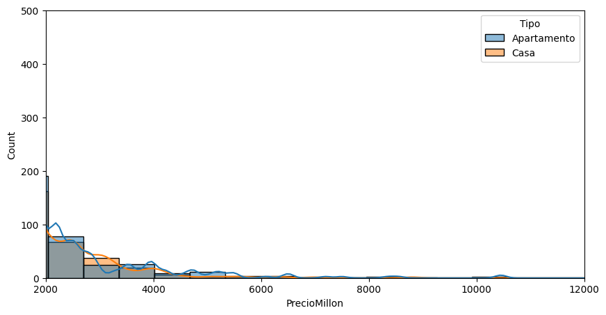
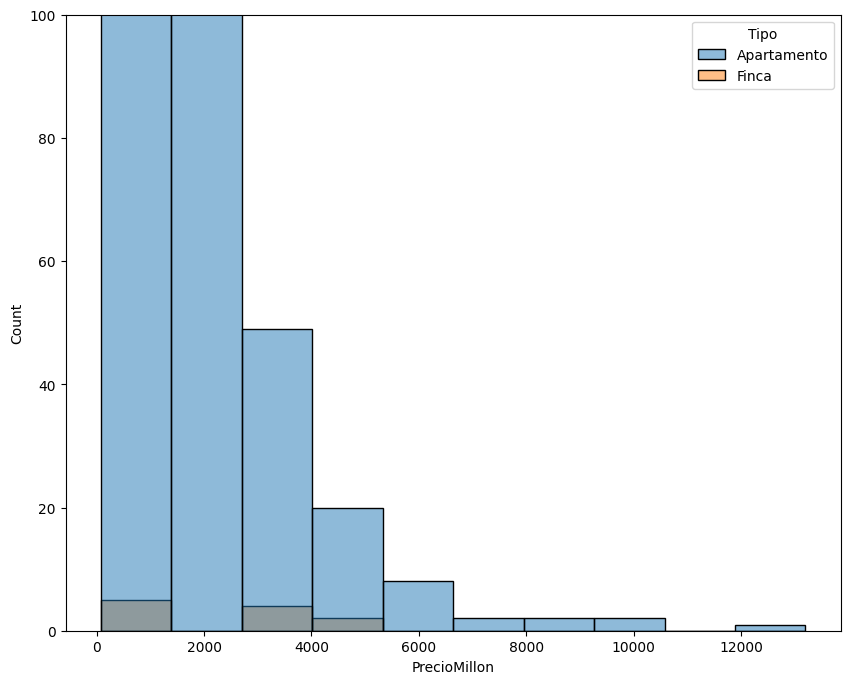

# Resolución de Desafíos del segundo Curso de Inmersión de Datos de Alura Latam

En el segundo día y curso de los 4 cursos de la serie Inmersión de Datos de Alura Latam los instructores dejan los siguientes desafíos:

<ul>
<li><b>1. Estudiar mejor el histograma de valores, seleccionar 3 tipos de inmuebles (Refinar el gráfico: Títulos, aumentar el tamaño de labels, colores, conclusión de la información)</b></li>

<li><b>2. Precio del m2 por barrio y hacer el gráfico más adecuado para esta nueva variable.</b></li>
</ul>

Empezaré por resolver el segundo desafío para luego realizar el primer desafío.

## **Resolución del segundo desafío**

Necesito calcular el precio por metro cuadrado y para ello necesito agrupar por barrios la suma de las columnas denominadas PrecioMillon y Area, lo anterior lo realizo escribiendo el siguiente código:

```
BarrioAcumulado=inmuebles[['Barrio','Area','PrecioMillon']].groupby(['Barrio']).sum()
BarrioAcumulado['Precio por Metro Cuadrado']=BarrioAcumulado['PrecioMillon']/BarrioAcumulado['Area']
BarrioAcumulado.head()
```

Dicho código me muestra lo siguiente:



Ahora deseo que el index **Barrio** aparezca como columna y luego seleccionar solo la columna **Barrio** junto con la columna llamada **Precio por Metro Cuadrado** y para ello escribo el siguiente código:

```
BarrioValorMetroCuadrado=BarrioAcumulado.reset_index()[['Barrio','Precio por Metro Cuadrado']]
BarrioValorMetroCuadrado.sort_values(by=['Precio por Metro Cuadrado'], ascending=False).tail(10)
```

Dicho código me muestra lo siguiente:



Ahora necesito crear gráficos para mostrar la data de manera más amigable. Para ello crearé un primer gráfico solo para el TOP 10 de precios mayores por metro cuadrado y luego crearé un **gráfico combinado** en el cual muestro el TOP 10 de precios mayores por metro cuadrado y TOP 10 de precios menores por metro cuadrado.

Para crear el primer gráfico el cual corresponde al TOP 10 de precios mayores por metro cuadrado necesito crear antes el DataFrame con el TOP 10 de precios mayores por metro cuadrado y para ello escribo el siguiente código:

```
top10=BarrioValorMetroCuadrado.sort_values(by=['Precio por Metro Cuadrado'], ascending=False).head(10)
```

Luego escribo el siguiente código para realizar el gráfico:

```
plt.barh(top10['Barrio'], top10['Precio por Metro Cuadrado'],color='orange')
plt.gca().invert_yaxis()
plt.title('TOP 10 de Barrios con mayor Precio del metro cuadrado')
plt.xlabel('Precio por Metro Cuadrado')
plt.ylabel('Barrios')
for valor, categoria in zip(top10['Precio por Metro Cuadrado'], top10['Barrio']):
    plt.text(valor, categoria, str('%.2f' %valor), ha='left', va='center')
```

Dicho código me genera un gráfico de barras horizontal mostrando los mayores precios por metro cuadrado en orden descendente y además he cambiado el color por defecto de las columnas al color naranjo y he agregado etiquetas en las puntas de las barras mostrando los valores con dos decimales.

El gráfico que se genera es el siguiente:



Ahora crearé el gráfico combinado en el cual muestro al lado izquierdo el TOP 10 de Barrios con mayor Precio del metro cuadrado y al lado derecho muestro TOP 10 de Barrios con menor Precio del metro cuadrado. Para ello escribo el siguiente código:

```
inmuebles_mayor_precio = BarrioValorMetroCuadrado.sort_values(by=['Precio por Metro Cuadrado'], ascending=False).head(10)

inmuebles_menor_precio = BarrioValorMetroCuadrado.sort_values(by=['Precio por Metro Cuadrado']).head(10)

fig, axs = plt.subplots(1, 2, figsize=(12, 5))

# Primer gráfico: Top 10 de barrios con mayor precio promedio
axs[0].barh(inmuebles_mayor_precio['Barrio'], inmuebles_mayor_precio['Precio por Metro Cuadrado'], color='green')
axs[0].invert_yaxis()
axs[0].set_xlabel('Precio Promedio')
axs[0].set_ylabel('Barrio')
axs[0].set_title('Top 10 Barrios con Mayor Precio Promedio',fontweight='bold')
for valor, categoria in zip(inmuebles_mayor_precio['Precio por Metro Cuadrado'], inmuebles_mayor_precio['Barrio']):
    axs[0].text(valor, categoria, str('%.2f' %valor), ha='left', va='center')

# Segundo gráfico: Top 10 de barrios con menor precio promedio
axs[1].barh(inmuebles_menor_precio['Barrio'], inmuebles_menor_precio['Precio por Metro Cuadrado'], color='blue')
axs[1].invert_yaxis()
axs[1].set_xlabel('Precio Promedio')
axs[1].set_ylabel('Barrio')
axs[1].set_title('Top 10 Barrios con Menor Precio Promedio',fontweight='bold')
for valor, categoria in zip(inmuebles_menor_precio['Precio por Metro Cuadrado'], inmuebles_menor_precio['Barrio']):
    axs[1].text(valor, categoria, str('%.2f' %valor), ha='left', va='center')

# Ajustar el espacio entre subgráficos
plt.tight_layout()

# Mostrar la figura con los dos gráficos
plt.show()
```

Dicho código me muestra el siguiente gráfico combinado:



Lo que he realizado es crear un una figura con una fila y 2 columnas y en cada columna he agregado cada subplot. Además, he cambiado los colores de las barras, la orientación de las barras, he agregado etiquetas a las barras con dos decimales, he colocado el título con negrita y he agregado labels a los ejes de coordenadas.

## **Resolución del primer desafío**

Tomando lo que ha dicho Christian al final de curso, he seleccionado los tres tipos de propiedades siguientes: **Casa**, **Apartamento** y **Finca**. Lo que deseo realizar es analizar por **separado** los tres tipos de propiedades y obtener su distribución de frecuencias. En primer lugar, obtendré la distribución de frecuencias para las casas para luego mostrar en un mismo gráfico, la distribución de frecuencias para cada tipo de propiedadad.

Para obtener la distribución de frecuencias para las casas escribo el siguiente código:

```
plt.figure(figsize=(10,6))
grafica1 = sns.histplot(data=inmuebles[inmuebles['Tipo']=='Casa'], x='PrecioMillon', kde=True, hue='Tipo')
grafica1.set(title='Distribución de Precio en Millones de los inmuebles tipo Casa en Bogotá')
plt.xlabel('Precio en Millones de $ Colombianos')
plt.ylabel('Frecuencia')
```

Dicho código me muestra el siguiente gráfico:



Ahora lo que haré crear un **gráfico combinado** en el cual mostraré los tres tipos de propiedades que he seleccionado que son: **Casa**, **Apartamento** y **Finca**. Para ello escribo el siguiente código:

```
arrayTipo=['Apartamento','Casa','Finca']
colores = ['blue', 'green', 'red']
fig, axs = plt.subplots(1, 3, figsize=(15, 5))
for i, tipo in enumerate(arrayTipo):
    datos_tipo = inmuebles[inmuebles['Tipo'] == tipo]
    sns.histplot(data=datos_tipo, x='PrecioMillon', bins=20, kde=True, ax=axs[i],color=colores[i])
    axs[i].set_xlabel('Precio en Millones')
    axs[i].set_ylabel('Frecuencia')
    axs[i].set_title(f'Histograma de Precios de {tipo}', fontweight='bold', color=colores[i])
plt.show()
```

Dicho código me genera el siguiente gráfico combinado:



Como se puede observar, he creado en cada gráfico un titulo con el mismo color de las columnas y en negrita, he cambiado el color de las columnas, he agregado etiquetas a cada columna y he agregado etiquetas a cada eje de coordenadas.

Ahora lo que realizaré es una comparación entre lso histogramas de Apartamento y Casas y para ello escribo el siguiente código:

```
DataCasaApartamento=inmuebles[inmuebles['Tipo'].isin(['Casa','Apartamento'])]
plt.figure(figsize=(10,5))
grafica=sns.histplot(data=DataCasaApartamento,x='PrecioMillon',kde=True,hue='Tipo')
```

Dicho código me genera el siguiente gráfico:



Se observa en dicho gráfico un comportamiento similar de las distribuciones antes de los 2000 millones. Sin embargo, necesito realizar un **zoom** para ver cómo se comportan las distribuciones para valores superiores a los 2000 millones y para ello escribo el siguiente código:

```
DataCasaApartamento=inmuebles[inmuebles['Tipo'].isin(['Casa','Apartamento'])]
plt.figure(figsize=(10,5))
plt.xlim((2000,12000))
plt.ylim((0,500))
grafica=sns.histplot(data=DataCasaApartamento,x='PrecioMillon',kde=True,hue='Tipo',bins=20)
```

Dicho código me genera la siguiente gráfica:



Se observa en este caso que para valores superiores a los 2000 millones de pesos colombianos las distribuciones se comportan de modo similar.

Ahora realizaré una comparación de Apartamentos y Fincas en el cual aprovecho de realizar un **zoom** y para ello escribo el siguiente código:

```
DataCasaFinca=inmuebles[inmuebles['Tipo'].isin(['Finca','Apartamento'])]
plt.figure(figsize=(10,8))
grafica=sns.histplot(data=DataCasaFinca,x='PrecioMillon',hue='Tipo',bins=10)
plt.ylim((0,100))
```

Realizo un zoom debido a como bien puede observarse del gráfico combinado de histogramas, la distribución de frecuencias para las fincas es, notoriamente, distinta en comparación a las distribuciones de Casas y Apartamentos. El código me genera el siguiente plot:



Por último y en base a los gráficos realizados concluyo lo siguiente:

## **Conclusiones**

Al comparar las Casas, Apartamentos y Fincas se observa que la cantidad de apartamentos es por lejos lo que mayor se presenta, es decir, ocurre con mayor frecuencia. Para los tres tipos se observa que la concentración de frecuencia se presenta en los precios menores siendo esto más evidente para las casas y apartamentos. Para el caso de las casas y apartamentos se observa una cierta continuidad de precios lo que significa que la oferta es diversa y que cubre varios segmentos de clientes. Para el caso de las fincas, se observa que los precios son más discretos y la frecuencia es marcada y notoriamente menor frente a los apartamentos y las casas. Por último, se observa que para precios altos, aproximadamente, sobre los 2000 Millones la frecuencia de las casas y apartamentos se comporta de manera similar.
